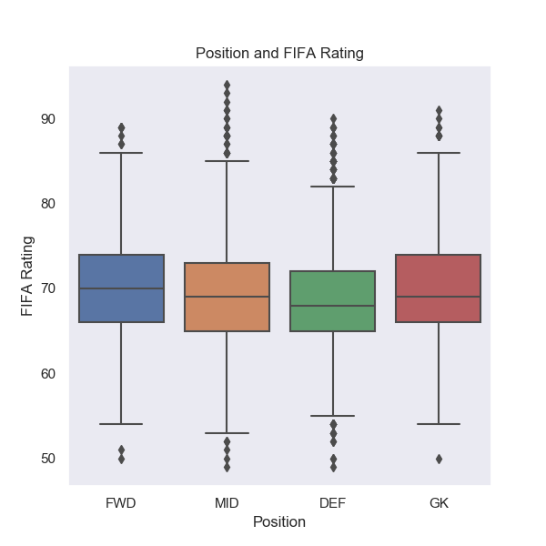
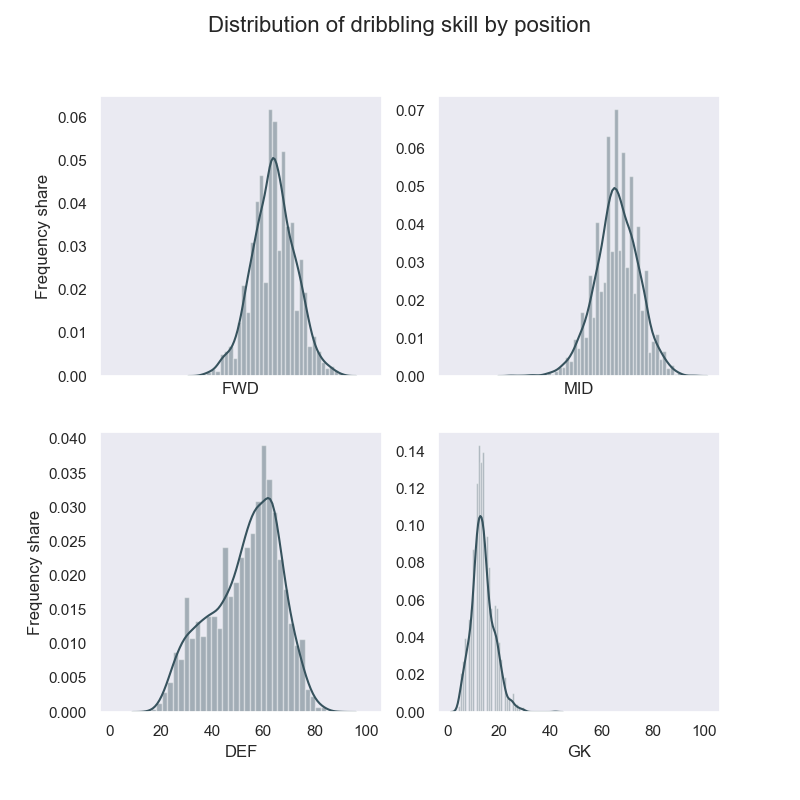
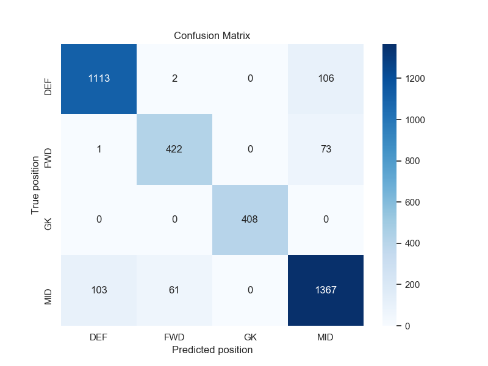

# cebd1160: Predicting player's position from FIFA 2020 skills data

| Name | Date |
|:-------|:---------------|
|Donald Lafrance| March 24, 2020|

-----

### Resources

- Python script for your analysis: `fifa_log.py`
- Results figure/saved file: `plots/`

-----

## Research Question

Can a football player's set of skills predict their position on the field?

### Abstract

The EA Sports [FIFA video game](https://www.ea.com/games/fifa/fifa-20) is the definitive game for football fans across the world, with the series selling over 260 million copies as of 2018. Each player in the game has an overall rating (0-100) which is a function of 34 different skills such as passing, shooting and agility. With this data available, we are able to gather insight into the game and the player's themselves to see which factors make them good.

Obviously, the required skill set for each position is likely different. The challenge is to find out whether the skills data can correctly predict the player's position on the field, and which skills are most important for each position.

This classification problem can be approached with the supervised learning model of logistic regression. The results yield an accuracy of `0.91`, proving that the level of different skills can predict the player's position at a performant rate.

### Introduction

The dataset was pulled from [Kaggle](https://www.kaggle.com/stefanoleone992/fifa-20-complete-player-dataset) with only the 2020 edition data selected. Features include:

- Player positions, with the role in the club and in the national team
- Player attributes with statistics as Attacking, Skills, Defense, Mentality, GK Skills, etc.
- Player personal data like Nationality, Club, DateOfBirth, Wage, Salary, etc.

The shape of the dataset is `(18278, 104)`, but was reduced to 34 features for the model.

### Methods

Logistic regression was used to model this dataset, using the algorithm from the scikit-learn package.
Code for this algorithm can be found [here](https://scikitlearn.org/stable/modules/generated/sklearn.linear_model.LogisticRegression.html).

In summary, logistic regression seeks to model the probabilty of the occurence of a categorical variable. In this case, our target is the player's position split into 4 categories (FWD, DEF, MID, GK) making this dataset ideal for supervised learning classification.

### Results

When looking at overall FIFA Rating of the players in the dataset, the distributions by position are very similar with only marginal differences.



However, each position has strengths and weaknesses with regards to the different skills. For example, the skill of "dribbling" is distributed differently across positions. Midfielders require strong dribbling skills, so as do forwards, whereas the distribution is flattened for defenders and unnecessary for goalkeepers.



Therefore the dataset can likely predict that player's position based on their rating for the different skills. The potential for a classification model becomes evident even when looking at the top 3 skills per position:

- Position FWD: movement_sprint_speed, power_strength, movement_acceleration
- Position MID: movement_balance, movement_agility, movement_acceleration
- Position DEF: power_strength, power_jumping, power_stamina
- Position GK: goalkeeping_reflexes, goalkeeping_diving, goalkeeping_positioning

#### Logistic regression model

The logistic regression model was able to correctly predict the true position of the players at a high rate, with an accuracy score of `0.91`. The classification report below shows high levels of precision, recall and, in turn, the f1-score by position. 

```python
Classification Report
              precision    recall  f1-score   support

         DEF       0.91      0.91      0.91      1221
         FWD       0.87      0.85      0.86       496
          GK       1.00      1.00      1.00       408
         MID       0.88      0.89      0.89      1531

    accuracy                           0.91      3656
   macro avg       0.92      0.91      0.92      3656
weighted avg       0.91      0.91      0.91      3656
```

From the confusion matrix, we see that all goalkeepers were predicted to be goalkeepers, which makes sense as their skill set is very specific to their prosition. On the other hand, the skills from defenders and forwards can be associated to the midfielder position. This position holds the largest range in skills as some midfielders focus more on defending while others on attacking.



### Discussion

The logistic regression method was performant in predicting the player's position from the skill features. Certainly, the model wasn't perfect, but overall a player's skill set will predict their position on the field with high accuracy.

It would be interesting to see if the player's who were not well classified could actually be solid candidates for other positions. Maybe certain midfielders would actually be better defenders, while some might be better suited as forwards. I can say with certainty that none of them would be proper professional goalkeepers!

### References

- Data set: https://www.kaggle.com/stefanoleone992/fifa-20-complete-player-dataset
- Logistic regression package: https://scikitlearn.org/stable/modules/generated/sklearn.linear_model.LogisticRegression.html

-------
