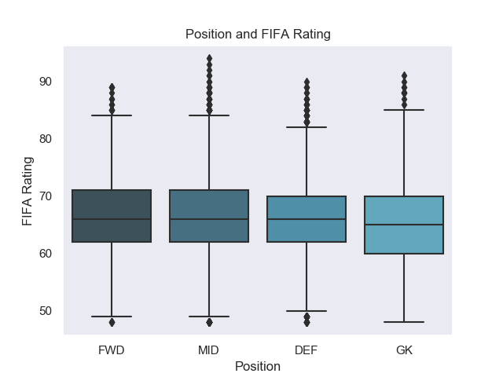

# cebd1160: Predicting player's position from FIFA 2020 skills data

| Name | Date |
|:-------|:---------------|
|Donald Lafrance| March 23, 2020|

-----

### Resources
Your repository should include the following:

- Python script for your analysis
- Results figure/saved file
- Dockerfile for your experiment
- runtime-instructions in a file named RUNME.md

-----

## Research Question

Can a football player's set of skills predict their position on the field?

### Abstract

The EA Sports [FIFA video game](https://www.ea.com/games/fifa/fifa-20) is the definitive game for football fans across the world, with the series selling over 260 million copies as of 2018. Each player in the game has an overall rating (0-100) which is a function of 34 different skills such as passing, shooting and agility. With this data available, we are able to gather insight into the game and the player's themselves to see which factors make them good.

Obviously, the required skill set for each position is likely different. The challenge is to find out whether the skills data can correctly predict the player's position on the field, and which skills are most important for each position.

This classification problem can be approached with the supervised learning model of logistic regression.

- action (how will we try to solve this problem/answer this question)
- resolution (what did we end up producing)

### Introduction

The dataset was pulled from [Kaggle](https://www.kaggle.com/stefanoleone992/fifa-20-complete-player-dataset) with only the 2020 edition data selected. Features include:

- Player positions, with the role in the club and in the national team
- Player attributes with statistics as Attacking, Skills, Defense, Mentality, GK Skills, etc.
- Player personal data like Nationality, Club, DateOfBirth, Wage, Salary, etc.

### Methods

Logistic regression was used to model this dataset, using the algorithm from the scikit-learn package.
Code for this algorithm can be found [here](https://scikitlearn.org/stable/modules/generated/sklearn.linear_model.LogisticRegression.html).

In summary, logistic regression seeks to model the probabilty of the occurence of a categorical variable. In this case, our target is the player's position split into 4 categories (FWD, DEF, MID, GK) making this dataset ideal for supervised learning classification.

### Results

When looking at overall FIFA Rating of the players in the dataset, the distributions by position are very similar with only marginal differences.

However, each position has strengths and weaknesses with regards to the different skills. For example, the skill of "dribbling" is distributed differently across positions. Midfielders require strong dribbling skills, so as do forwards, whereas the distribution is flattened for defenders and unnecessary for goalkeepers.

Therefore the dataset can likely predict that player's position based on their rating for the different skills. The potential for a classification model becomes evident even when looking at the top 3 skills per position:

- Position FWD: movement_sprint_speed, power_strength, movement_acceleration
- Position MID: movement_balance, movement_agility, movement_acceleration
- Position DEF: power_strength, power_jumping, power_stamina
- Position GK: goalkeeping_reflexes, goalkeeping_diving, goalkeeping_positioning

### Discussion
Brief (no more than 1-2 paragraph) description about what you did. Include:

- interpretation of whether your method "solved" the problem
- suggested next step that could make it better.

### References
All of the links

-------
